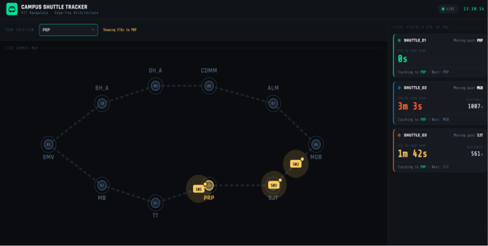
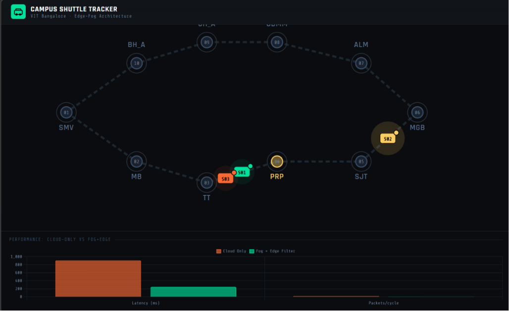

# Fog-Assisted Real-Time Shuttle Tracking

## Overview

Fog-Assisted Real-Time Shuttle Tracking is a distributed IoT-based transportation monitoring system designed to improve shuttle tracking accuracy and responsiveness within a smart campus environment. The system leverages a three-tier architecture consisting of Edge, Fog, and Cloud layers to optimize real-time telemetry processing and ETA prediction.

Unlike conventional cloud-only tracking solutions, this system performs movement interpolation at the Edge layer and route-aware ETA calculations at the Fog layer, resulting in smoother visualization, reduced network traffic, and lower latency.

## Features

* Real-time shuttle tracking and monitoring
* Edge-level movement interpolation for smooth shuttle visualization
* Fog-based route-aware ETA prediction
* Topological routing using campus-specific shuttle paths
* REST API communication between system layers
* Digital Twin dashboard for shuttle visualization
* Performance benchmarking against traditional cloud-only architectures

## System Architecture

### Edge Layer

* Simulates shuttle movement
* Performs linear interpolation between route coordinates
* Generates high-resolution telemetry data
* Sends optimized updates to the Fog layer

### Fog Layer

* Processes incoming telemetry data
* Calculates route-aware ETAs
* Maintains shuttle state information
* Reduces dependency on centralized cloud processing

### Cloud/Application Layer

* Provides web-based dashboard access
* Displays real-time shuttle positions
* Performs map snapping for visual consistency
* Visualizes system performance metrics

## Technologies Used

* Python
* Flask
* REST APIs
* HTML5
* JavaScript
* SVG Maps
* Chart.js

## Project Structure
```text
fog-assisted-shuttle-tracking/
│
├── cloud/
│   └── cloud_client.py
│
├── edge/
│   ├── __init__.py
│   ├── edge_filter.py
│   └── edge_simulator.py
│
├── fog/
│   ├── __init__.py
│   ├── eta_calculator.py
│   └── fog_server.py
│
├── front-end/
│   ├── __init__.py
│   ├── app.py
│   ├── templates/
│   │   └── index.html
│   └── static/
│       ├── css/
│       ├── js/
│       ├── images/
│       └── ...
│
├── metrics/
│   └── performance_analysis.py
|
├── docs/
│   ├──shuttletracker1.png
│   ├── shuttletrackerperf.png
│
└── README.md
```
## Results

The proposed Edge-Fog architecture demonstrated significant improvements over a traditional cloud-only approach:

* Reduced latency from approximately 910 ms to 252 ms
* Achieved approximately 72% improvement in responsiveness
* Reduced packet transmission from 20 packets per cycle to 8 packets per cycle
* Improved ETA accuracy through topology-aware route calculations

## Future Improvements

* Integration with real GPS-enabled shuttle hardware
* Mobile application support
* Multi-route campus deployment
* Predictive analytics using machine learning
* Traffic-aware ETA estimation

## Dashboard



## Performance Benchmark


